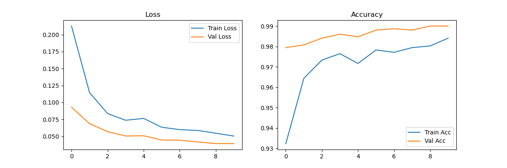

# Face Mask Detection
To build a binary image classifier Mask vs. No Mask using a pre-trained ResNet18 model

## Model
- Architecture: ResNet18 (Transfer Learning)
- Dataset: [7,553 picture dataset (Kaggle)](https://www.kaggle.com/datasets/omkargurav/face-mask-dataset)
- Best Val Accuracy: 99.01% (Epoch 10)

## Installation
pip install -r requirements.txt

## Train
python train.py

## Run App
streamlit run app.py

## Results

## Output
| Without Mask | With Mask |
|---|---|
|  |  |
